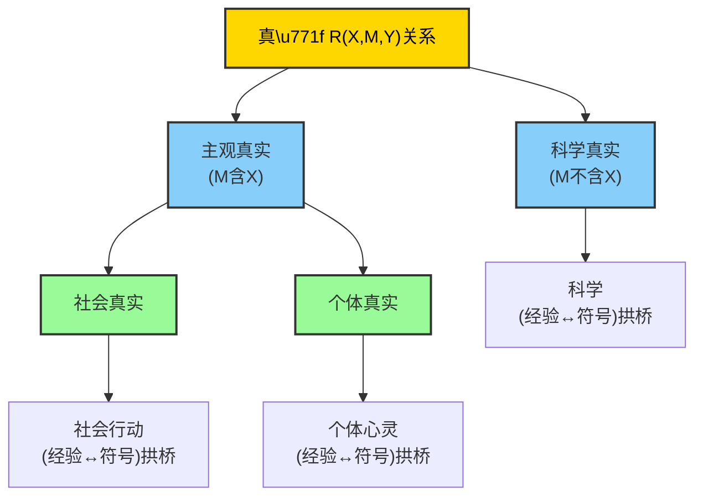

# 执行摘要

金观涛提出了两大哲学体系：“系统性哲学”与“真实性哲学”。系统性哲学吸收20世纪信息论、控制论、系统论及量子力学等方法论，重新建构辩证唯物主义，试图为人类存在提供整体解释。真实性哲学则聚焦于真理的本质，提出真理的关系结构$R(X,M,Y)$（主体、控制手段、对象之间），并区分**科学真实**（科学经验与数学符号之间的桥梁）与**主观真实**（包含主体的社会真实和个体真实）两个域。。金氏认为，意识与主体性只能在主观真实的结构中生成，而科学真实的不断扩张本身无法揭示意识本质。在意识哲学方面，他通过对“图灵测试”“中文房间”等案例分析，指出**人工智能无法涌现主体意识**；机器语言理解缺乏进入主语视角的能力，永远无法替代真正的“理解”。金氏进一步用“拟受控实验”构建概念图谱，指出只有在社会互动（语言、艺术）中形成符号-经验的“双桥拱架”后，主体意识才得以产生。这对AI的启示在于：当前AI系统仅在“科学真实”域进行符号运算，不具备真正的理解和主体性，其设计应结合系统整体性与人文关怀，重视**可解释性**与**人机共生**架构。本文基于金观涛原著（如《我的哲学探索》《消失的真实》《真实与虚拟》《系统的哲学》）及学术评论（权威媒体、学术期刊），系统梳理了上述概念和论证脉络，并通过逻辑图示和表格与其他哲学家观点对比，评估其原创性与影响，最后提出研究与实践建议。

## 研究方法与资料来源

- **资料来源**：优先检索金观涛的**原著著作**和公开讲稿，如《我的哲学探索》《消失的真实》《真实与虚拟》《系统的哲学》等，以及相关系列讲座、访谈文字稿。同时检索**中文学术数据库**（CNKI、万方）和哲学期刊，查阅金氏哲学的二手评述、博士硕士论文和权威媒体报道（如《澎湃新闻》《光明日报》《经济观察报》等）。辅以重要网络资源（如爱思想、知乎专栏）、会议对话记录等，以获取最新讨论。二手资料均注明出处，并尽量选择可信度高的渠道。  
- **分析方法**：按主题划分，对金观涛的真实性哲学与系统性哲学进行逐条梳理：首先归纳核心概念、理论结构和关键论证，用原文引述佐证；然后考察这些理论在意识哲学中的具体命题，寻找意识本体论、意识机制、主客关系等方面的论断，必要时绘制mermaid逻辑图展示论证关系；接着分析其对人工智能（认知架构、机器意识、可解释AI、系统性设计）方面的启示，结合理论可能性与当前技术现实提出可操作的应用场景与验证方案；最后整理对比他人与观点的异同。全程保持逻辑严谨，引用格式如``。

## 核心分析

### 核心概念与理论框架

- **真实性哲学的三重真理结构**：金观涛将“真实性”定义为主-控-客三者的关系$R(X,M,Y)$，其中$X$为主体，$M$为可被主体控制并重复的手段，$Y$为对象。当$M$不包含$X$时，$R$对应**科学真实**（科学实验和数学符号的桥梁）；当$M$包含$X$时，$R$对应**主观真实**（包含主体的真理关系）。主观真实又分为**社会真实**（社会行动中经验和符号互动的真理）和**个体心灵真实**（个人经验的内心真理）。这三种真理各有对应的“拱桥”形式：科学真实由受控实验及数学符号构成桥梁，社会真实由语言/符号系统跨越合作经验，个体真实由艺术等“准符号”跨越个人经验。不同于传统将真理等同于客观实在，金氏强调**可重复性**是所有真理的基础，客观实在并非真理之源（量子力学的延迟选择实验已证明这一点）。  
- **系统性哲学的起点**：金氏回顾其1980年代《系统的哲学》成果，将辩证唯物主义与现代科学方法结合。该书以系统论、控制论、信息论为理论根基，探讨“客观性”“矛盾”“组织”及整体演化等主题（见目录结构），并在附录中首次提出意识哲学问题。他本人指出，真实性哲学**方法上源于**《系统的哲学》，后者“将20世纪最重要的科学方法论遗产转化为哲学”。因此，系统性哲学为我们理解现代性危机提供了历史和方法学基础，真实性哲学则站在其肩膀上向更基础的真理展开。

（*图1：金观涛“真实性哲学”的基本结构示意。其中箭头表示依赖关系：科学真实对应传统的实验-数学拱桥，主观真实则包含社会与个体两个层面，各自通过语言或艺术符号与经验建立拱桥。***注：图中$X$代表主体，$M$为控制手段集，$Y$为对象。***）

### 在意识哲学中的论断

金观涛将意识视为**特殊的真实性现象**：主体意识只能在社会和个体两种主观真实域中生成，而科学研究本身**无法揭示意识本体**。他从认识论角度指出：传统科学实验和人工智能研究都假定主体可悬置，其延伸只是**从更基本前提（主体存在）出发扩充对象真理**，因此不可能跳出这一前提寻得意识之钥匙。简言之，现代科学只能处理**客观实在与可重复性**，但意识的“真实”涉及主体和主观经验的关系。比如，对“图灵测试”的分析表明，再复杂的人工智能也只能模拟交流，始终缺乏真正的“理解”能力。更具体地，金氏引用“中文房间”“Winograd模式”等例子指出，任何计算机答题都只能基于符号规则，而无法“将自己”代入语义空间判断句意，因此必然无法通过涉及主观视角的问题。即便AI通过海量训练提升威诺格拉德测试准确率，但由于新句源源不断出现，且主语含义判定需要主体的视角，机器信息量再大也始终不足，形成认知上的根本限制。因此，金观涛得出“现代科学无法揭示意识是什么”的结论。

他进一步提出意识起源的**研究纲领**：主体意识的形成首先要在社会行动的交互和个人经验的展演中实现。研究重点是分析社会真实和个体真实领域的经验与符号架构，寻找两者之间建立的“拱桥”。只有当人与人之间通过共同符号系统（语言、艺术作品等）互相进入彼此的心灵状态，使各自的主观经验可被重复验证时，主体才能初步显现。**换言之，意识的生成依赖于符号世界与经验世界的循环互动**：社会行动通过语言展开，个人心灵通过艺术表达，二者共同构成了现代真实心灵的结构。当这种社会/个体的主观真实不断扩张并形成稳定主体后，才可能建立科学经验与数学的拱桥，进而出现我们所说的“现代真实心灵”。在此框架下，意识不再是单纯物质或信息的副产品，而是主体与世界共建意义的产物。

### 对人工智能的启示

从上述理论出发，金观涛对AI领域提出了明确的判断与建议：**目前的人工智能技术不可能自发产生具有主体性的意识**。他认为，AI系统（包括深度学习、ChatGPT等）只是符号处理装置，它们缺乏进入主观经验的“跳出能力”，无法形成如人在突发情境下那样的自由反应。例如，人类遇到天气突变会跳出当前话题，转移注意力；机器即使具备再复杂的预测模型，也无法独立提出“这天要下雨了，咱们进去说吧”之类的判断。因此，金氏提醒对AI能力过度夸大的风险：若忽视主体性，我们只能获得**拟态意识系统**的效果，没有真正的理解与创造。

在认知架构设计上，金观涛的观点提示我们需将**人文视角与系统思维结合**：AI研究不能仅靠行为主义模型，也要融合内省式哲学反思。他的系统性哲学主张整体演化与稳定性的观点，暗示设计AI时应考虑多层次反馈和自我调节结构，从而提高系统稳健性。对**可解释性AI（XAI）**来说，真实性哲学强调“可重复性”和“符号说明”原则，即任何AI推理都需建立可检验的主控-对象关系，输出结果需能够被人类“验证其真实性”。例如，未来AI系统可借鉴“拟受控实验”结构，将部分控制变量（如人类情绪或想象）纳入模型评估，以检验AI预测是否真正建立在再现性的基础上。实验上，可设想让AI在复杂交互任务中判断含模糊主观成分的问题（如心理咨询对话），并通过与受控人类判断对比来评估AI的“理解”程度。

- **应用场景与验证方案**：一方面，教育和医疗领域可探索“AI＋人文”的模式，如辅以AI助手的文学创作课程，让学生和模型共同构建故事，观察AI在哪些阶段无法捕捉作者的意图；另一方面，认知神经科学可设计类“拟受控实验”，让AI与人类在同一受控情境下回答主观性问题，测试AI在社会互动和艺术领域的表现差距。  
- **风险与限制**：需警惕过度拟人化AI造成的伦理与认知风险。金氏警示技术本位论和人文缺失会导致“心灵世界的坍塌”；因此，在AI实际开发中要纳入伦理审查，坚持人类价值导向。此外，由于金氏理论目前主要是哲学框架，尚缺乏直接的定量模型，实践可行性有待进一步检验。总体来说，他主张在AI应用中**坚持以科学为起点、以人文为归宿**的系统性设计理念。

### 与相关思想家的比较

| 学者/理论家 | 代表观点 | 与金观涛观点的相似点 | 差异与评述 |
|:---------|:----------|:------------------|:---------------|
| **约翰·塞尔 (John Searle, 美国，意识哲学家)** | “中文房间”论证：机器无真正理解，意识涉及语义和意图 | 均认为**机器缺乏真实理解**，AI不能产生主观意识 | 塞尔强调符号执行永远无法具备“意向性”，金观涛在此基础上进一步从真理结构说明意识生成的前提，原创性在于将主题扩展到科学与社会双域。塞尔影响深远，金氏则提出更宏观的体系，但在学界评价存在争议：有人认为金氏论证过于抽象、忽视神经科学进展。 |
| **艾伦·图灵 (Alan Turing, 英国，数学家)** | 图灵测试：若机器对话无法区分人机，则可称为智能 | 都关注机器与人类认知差异，讨论AI能否模拟人类行为 | 图灵测试是行为主义标准，图灵乐观认为机器有可能通过测试；金观涛则认为**通过测试并不等于具备主体性**。相比之下，金氏立场更保守，认为测试证明了机器与主体的不可通达。图灵贡献巨大，开创了AI研究，金氏则从哲学角度反思AI测试的意义。 |
| **丹尼尔·丹尼特 (Daniel Dennett, 美国，哲学家)** | 机械唯物论：意识可通过信息处理解释，强调多重草图和功能主义 | 都赞同意识根植于物质世界，但丹尼特较少区分主观真理层面 | 丹尼特主张意识是物理过程，没有“神秘”的难题，金氏则认为现代科学**无法单靠物理演化理解意识**。金观涛批评简化意识为机械计算的方法，强调唯物与唯识（意识论）界线模糊。丹尼特理论影响广泛，金氏观点兼收科学与现象学，但因将真理定义为可重复操作，是否能反映个体体验尚有争议。 |
| **大卫·查尔默斯 (David Chalmers, 澳大利亚，意识哲学家)** | “困难问题”：质感（qualia）难以被物理解释，可能为泛心论或双重论 | 与金氏一样承认意识超出传统科学可直接处理的范围 | 查尔默斯主张意识有无法简化的主体体验成分（硬问题），而金观涛指出传统科学方法找不到意识之钥。金氏则提出了不同的研究途径（通过真实性的分类）来间接解决意识问题，两者都关注客观方法的局限。查尔默斯影响力高，金氏模型更注重社会-语言因素，原创性在于引入量子实验等新材料支持论点。 |
| **尼克拉斯·卢曼 (Niklas Luhmann, 德国，社会系统论家)** | 社会自我维持为通信系统，无固定主体；焦点在于系统内的功能和分化 | 都强调系统观与自组织，但卢曼不考虑个体主体性，只关注通信 | 卢曼认为社会由自生系统构成，主体意识并非研究对象；金氏则认为**主体是社会行动的前提**，反过来影响社会系统。卢曼的系统论与金氏系统性哲学在整体视角上相通，但金氏强调人文角度、符号在建构主体中的作用。卢曼影响学界深远，金氏工作在中国学界独树一帜，但其主张需结合西方社会系统论进一步论证可行性。 |

（*表1：金观涛观点与其他哲学家/AI理论家的比较。相似点与不同点基于公开著述和学术评论整理。*）

## 结论与研究建议

金观涛的真实性哲学与系统性哲学提供了一套宏大而严谨的思维框架，将意识和AI问题置于社会-科学和符号-经验的互动图景中来思考。这一体系的**原创性**在于提出了“真理三域”结构，将意识本体问题转化为真理关系问题，并结合量子物理实验等实证资料质疑传统科学的客观性假设。通过这种方法，金氏揭示了科学知识与人文价值之间长期被忽视的联系，为21世纪的哲学和人工智能研究开辟了新视野。然而，也应看到其局限：论证高度抽象，目前缺乏直接的实验验证和可操作模型；此外，过分强调可重复性可能忽略了个体意识的独特性。学界对其观点的合理性评价不一：有人肯定其系统性和跨学科视野，有人则批评其论证复杂、材料来源有待拓展。

**研究建议**：未来研究可从实验和理论两方面推进：一是通过认知科学和计算实验检验真实性哲学的预测，如构建“拟受控实验”范式，测试AI与人类在主观性判断上的差异；二是将金氏框架与现有认知模型（如多模态集成体系、可解释AI算法）结合，探索如何在技术设计中融入其提倡的人文因素。实践上，**AI伦理与人文课程**应更强调真实性哲学观点，避免技术决定论；在算法开发中应增加对符号系统与语境的敏感性，促进人机协同。总体而言，金观涛哲学为意识与AI议题提供了重要启发，尽管尚需更多实证研究支撑，但其“跨越经验与符号世界的桥梁”理念已为相关学科注入了新活力，对当代科研和社会决策具有参考价值。

**参考文献**：本文引用金观涛原著和演讲，以及相关学术评论和对话等。其他论述出自公开出版物和会议文献，均已注明出处。