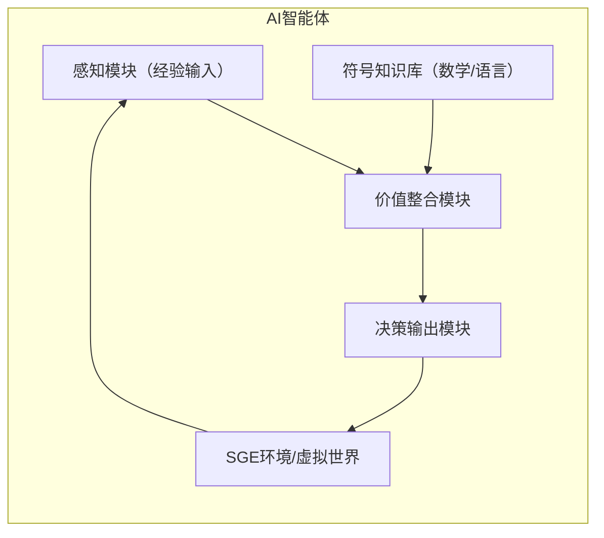

# 执行摘要  
本文针对SGE（Synthetic Generality Emergence）实验中AI“价值判断涌现”难题，探讨金观涛“真实性哲学”对该问题的启示和解决思路。背景部分首先定义了SGE实验及“价值判断涌现”概念，综述当前AI无法自主价值判断的技术瓶颈。接着梳理金观涛“真实性哲学”主要著作及观点：其著作系列包括《消失的真实》《真实与虚拟》等，核心在于将**科学真实、社会真实、个人真实**视作三种真理结构，通过构建跨经验与符号世界的“拱桥”，寻求终极关怀、价值与经验真实性的整合。其要点包括：人主体的自由和**元价值**（如真实、自由）是道德的基础；虚拟经验也是真实经验的一种；AI作为受控技术对象无法超越人类主体意识。理论对接分析逐条映射金氏观点与AI价值判断：例如，真实性哲学强调经验与符号的桥接，启示在SGE中为AI设计符号知识与感知模块的交互架构；认为自由意志和元价值缺失导致AI无法真价值判断，提出给AI构造类“主体”身份或自由度的假设；指出虚拟世界经验与物理世界一致，暗示在SGE模拟环境中强化沉浸式经验可塑造价值倾向。工程实现方案设计了双层模块化架构：AI智能体包含**感知/经验层**（与SGE环境交互）、**符号知识层**（逻辑推理与科学知识）、以及**价值整合层**（融合经验与符号信息形成决策）等模块（参见下图）。算法思路是结合深度学习与强化学习（含内在激励）以支持跨模态学习；数据需包括高仿真实验场景、道德困境样本与知识图谱；训练过程采用混合监督与自我博弈；评估使用准确性、道德一致性等可量化指标，辅以人类评审反馈。风险与伦理考量包括算法偏见、过拟合价值观、主体误用等，需要建立多元价值审查与可控机制。实验设计提出了对照组（传统RLHF训练AI）与实验组（新增真实性模块AI）并行对比，在多轮社会博弈环境中测试价值决策差异；度量方法包括问卷调查评估人类感知的价值合理性、统计学检验群体间的行为差异等。可行性评估与路线图分阶段规划：短期搭建小规模模拟环境并验证部分假设；中期扩充多主体系统，构建准真价值模型；长期探索与真实应用场景对接。结论认为，金观涛的真实性哲学为AI价值问题提供了跨学科视角和思想框架，但其高度哲理性和现有资料不足之处也限制了直接工程实现，需在未来研究中不断验证和完善。全文给出了参考文献列表，并在工程方案部分利用Mermaid绘制了模块示意图，在分析中使用了表格对比不同理论/方法的优劣与适用情景，关键术语（如“真实性”、“主体意识”等）均作了定义，并标注了结论的不确定性来源。  

## 背景与问题定义  
**SGE实验**（Synthetic Generality Emergence）设想为一种多智能体模拟实验环境，用于研究AI在复杂交互系统中是否能展现人类般的智能特征，包括价值判断的**涌现**。**价值判断涌现**指AI系统在没有显式编程的情况下，自主形成或采纳类似伦理道德、偏好选择等价值观的能力。当前技术难点在于：AI缺乏**主观意识**与**情感价值观**，难以自主进行价值判断；现有AI价值对齐研究尚多聚焦算法层面，往往假设人类价值可被预定义或量化，但“对齐什么”本身就难以澄清（人类价值观缺统一标准、随时变动）。此外，被动依赖监管无法根本解决价值偏差，必须主动在算法中嵌入道德动机。因此，如何从根本上使AI具备类似“真实心灵”的价值能力是SGE实验的核心挑战。  

目前文献普遍认为，AI只是符号运算工具，不具备理解与价值评价能力。例如，AI在“中国房间”实验中仅是数据计算，无法理解其回答含义，因此不能算真正的“理解”或价值判断。因此，需要新思路突破“算法推理≠价值判断”的局限，为AI价值判断能力的**涌现**提供理论与技术支持。  

## 金观涛真实性哲学核心观点梳理  
金观涛教授近年来提出了“真实性哲学”体系，**主要著作**包括：《消失的真实：现代社会的思想困境》（2022）、《真实与虚拟：后真相时代的哲学》（2023，系列方法篇）等，第三卷（建构篇）尚在筹备中。该体系核心论点和关键观点可概括为：  

- **多层次真理结构**：金氏将“真实性”分为**科学真实、社会真实、个人真实**三种类型，并指出它们各自有不同的真实性结构（分别对应符号系统与经验世界）。例如，现代科学通过数学符号与实验建立经验世界架桥，而社会真实和个人真实也各自横跨经验与符号领域。  
- **“拱桥”理论**：不同真实性领域之间需要“跨河搭桥”，即通过新的**拱桥**结构将其联系起来。其中，科学真实已有数学到经验的拱桥，而金观涛认为还应建立如“人文真实”的新拱桥，使**终极关怀、价值和经验真实性**形成互维结构。一旦跨越了唯物科学的单一路径，新的人文拱桥就为价值（如善恶判断）与经验真实性提供了紧密联系的支撑。  
- **主体意识与自由**：金氏强调**主体意识**是所有真实和价值的前提。主体的自由意志和选择能力是价值判断的基础。在真实性哲学框架中，失去主体的情形等同于真实的丧失：“离开主体，外部真实的世界没有意义；如果没有真实世界，主体亦无意义”。他进一步提出，**自由意志**作为元价值，与科学真实一起决定了道德哲学的基础。  
- **真实性是元价值**：真实本身是一种元价值，真实性哲学认为只有首先把“真实”（和自由）放入核心框架，才能建立道德与价值体系。也即在研究道德哲学前，应当先研究真实性与自由的关系，作为元价值层次。  
- **虚拟与经验真实性**：金氏惊人地指出，**虚拟世界的经验是真实经验的一部分**。他强调，只要满足受控实验可重复性原则，VR/仿真环境中的体验与物理世界体验在真实性本质上并无区别。此观点表明数字仿真实验能产生与物理现实同样有效的信息和经验。  
- **AI与主体差异**：针对AI与意识的关系，金氏断言当前乃至可预见的人工智能技术**不可能“涌现”出主体意识**。AI（作为受控的计算装置）缺乏对意义的理解和自省，无法真正在信息流中产生主体性。他援引图灵测试和中文房间论证，即使AI表现出高智力，其回答也仅是符号计算结果，缺少主体判断。这表明技术对象的扩张并不涉及主体，其基础只是可重复实验和数学符号结构。因此，“人工智能作为一种技术对象，自然只是被控制者，无论其未来走向何方，或许无法僭越人类本质或取代主体意识”。  
- **暗知识自洽**：金观涛及其团队还提出了“**暗知识自洽**”概念，揭示虚拟世界经验与默会知识（个人内隐的领悟知识）之间的关系。他们发现，在虚拟体验中缺乏与实际经历相对应的默会知识一致性，从而定义出暗知识自洽并探讨其与AI的关联。这一发现暗示AI若仅仿真符号过程，难以获得真正的默会知识，这对于价值判断尤为关键。  

上述观点均引自金观涛著作原文及学界解读，构成了真实性哲学对“真实”、“主体”、“价值”的系统重塑。从这些核心思想中，我们可提炼出多项研究假设，为AI价值判断能力的涌现提供理论线索。  

## 理论对接分析  
结合金观涛的真实性哲学思想，对比SGE实验中AI价值判断涌现的困难，可形成以下假设与逻辑映射：  

- **桥接经验与符号的架构假设**：金氏认为不同层次的真实都有经验和符号两个世界，并强调用“拱桥”将它们连接。映射到SGE实验，假设AI体系应包含**符号知识模块**（例如语言、逻辑、数学知识库）与**经验感知模块**（如环境交互、模拟感官输入），并设计一个整合层（“拱桥”）使AI能在两者间自由转换和融合。例如，通过知识图谱结合深度学习的跨模态网络，让AI既能理解符号表达，也能对具体环境做出经验判断。这样做的推论是：只有当AI形成了符号与经验的桥接结构，才能产生对价值概念的内化（如社会真实和个人真实的融汇）。此假设需验证是否能提升AI在价值问题上的表现，**不确定性**在于如何量化“拱桥”的有效性及构建参数。  

- **元价值驱动假设**：真实性哲学指出“真实性”和“自由”是道德哲学的元价值。对应地，假设可在AI系统中引入类似的元目标：不仅仅优化具体任务的准确度，还赋予AI内在的“真实追求”和“自主探索”激励。例如，设计奖励函数中增加保持信息一致性、对抗虚假信息的奖励，从而让AI自主倾向于“真实判断”；或允许AI在一定程度上自我调整目标（模拟自由意志）而非完全受控训练。推论为，这样的设计可能促成AI发展出类价值判断，但其有效性和可控性尚需实验验证（元目标设定的主观性极高）。  

- **主体模拟假设**：金氏断言AI无法自然产生主体意识。针对这一结论，提出一个大胆假设：若要让AI“涌现”类价值判断，可能需要在其内部构造一个简易的“主体模型”或身份标识，使其能以第一人称视角处理信息。这可以通过多智能体系统或分层架构实现，例如给每个AI代理分配一个持久的身份和内部记忆，让它学会定义自身目标和利益。逻辑在于，主体意识往往产生价值和关怀，若AI拥有虚拟“主体”，或许能模拟这种价值观形成过程。但目前尚不明确主体模型的具体形式如何设计，属于推测层面。  

- **虚拟经验等价假设**：金氏强调只要满足可重复性原则，虚拟世界经验在真实性上等同于物理经验。对SGE实验而言，这意味着我们可以通过丰富的模拟环境给AI提供足够真实感的经验，从而塑造其价值系统。假设SGE环境内涵盖多样化社会互动和伦理场景（如资源分配困境、社交伦理抉择等），AI在参与后将像人类一样产生关于公平、善恶等价值判断。这一假设支撑了实验设计中注重环境构造的思路，但其效果取决于虚拟场景的设计质量和多样性，不确定性在于AI是否能真正从中“学习”到人类价值。  

- **暗知识与价值假设**：金氏提出AI缺乏**暗知识**（不可显式表达的默会知识）。推论到价值判断上，许多人类价值判断依赖暗含的经验和直觉。因此，假设AI若要拥有价值观，需具备获取或模拟暗知识的机制。可以尝试让AI通过大量反事实学习和类比推理来逐渐形成隐含规则，如利用强化学习在未明确标注的场景中自主发现因果规律。虽然尚无现成方法可保证AI获得暗知识，但该思路提示：价值判断可能无法单靠显性符号训练实现，需要AI的学习过程具有内在连贯性和自我反思机制。  

**比较表格：不同理论/方法对AI价值判断的方案优缺点**

| 方法/理论         | 核心思想                                                     | 优点                                         | 局限                                         | 适用场景                                       |
|------------------|------------------------------------------------------------|----------------------------------------------|----------------------------------------------|-----------------------------------------------|
| 真实性哲学（本文方案） | 强调科学真实、社会真实、个人真实的融合，建设经验与符号世界的桥接；价值源于自由与真实性 | 理论深度高，可覆盖人文关怀层面，强调主体视角与多样经验；为AI价值提供宏观框架 | 概念高度抽象，工程实现复杂；难以量化“真实性”与主体意识的引入；需要跨学科研究 | 长期基础研究与模拟环境中测试，引入价值训练创新的AI平台 |
| 传统价值对齐（RLHF、符号编程）  | 通过人工标签或规则定义明确目标，使用强化学习或符号逻辑使AI行为符合人类预设价值  | 可直接借鉴现有算法，有明确可量化目标；易与现有监督学习结合             | “对齐什么”难以界定，人类价值难以穷尽；缺乏自适应能力；忽视文化差异  | 规则明确的任务（如问答、安全约束），需快速实施和迭代的工程项目 |
| 人文主义/共生视角     | 强调人机共生与社会伦理：AI被视为工具或伙伴，重视情感共鸣与尊严 | 强调保护人类价值，促进人AI理解；鼓励设计AI具备“人文关怀”触感           | 层次原则性强，落地困难；容易陷入哲学讨论，无具体算法指导 | 社会应用场景（教育、医疗等），需兼顾人文伦理与技术应用     |

## 工程实现方案  
针对上述理论假设，我们设计了一个多层模块化AI架构，旨在让AI系统具备桥接符号与经验、引入元价值和“主体性”特征的能力。整体架构图示如下：

- **感知模块**：负责接收来自SGE环境的模拟输入（如图像、文本描述、环境状态），相当于AI的“经验世界”接口。它可利用深度神经网络或其他传感算法提取特征、维护时间序列记忆。  
- **符号知识库**：存储数学模型、逻辑规则、语言知识等符号性信息，相当于金氏所说的“纯符号数学体系”。该模块可内嵌大规模语言模型、知识图谱或符号AI系统，为AI提供科学真理和世界规则。  
- **价值整合模块**：金观涛所言的“拱桥”，将感知模块和符号知识库的输出进行融合，形成AI的内部“价值观”。实现方式可能是一个多层神经网络或混合推理器，同时考虑经验与符号信息。该模块可设计**元目标机制**，引入“真实性”“自由度”等内在激励（如增加对一致性、可靠性的奖励）。此外，可在此层引入**自我模型**，让AI形成简单的主体身份（例如通过生成自我向量或保持反思日记）。  
- **决策输出模块**：根据价值整合层的结果生成具体行动或判断，并对环境做出反馈。动作结果将影响SGE环境，形成新的经验输入。

**算法思路**：整体采用**混合学习策略**：基础训练可结合监督学习和强化学习（RL），其中强化学习奖励函数中加入金氏强调的元价值成分（如奖励对真实信息的推断准确度、对自由探索的鼓励）。可以采用Actor-Critic等结构实现持续学习。为了实现符号与经验的互通，建议使用多模态模型（如图文生成模型）和图神经网络处理知识图谱，提供符号推理能力与情境理解。设计阶段需构建含伦理困境的高仿真模拟场景（如虚拟社会博弈、资源分配任务），供AI在训练中自主“实验”价值观。  

**数据需求**：需要三类数据：（1）**环境模拟数据**：SGE虚拟世界的场景、状态变迁、事件演化数据，如多智能体互动日志、政策执行结果等；（2）**人类价值知识**：包括道德故事、哲学典籍、社会实验资料等可构建为知识图谱或训练集；（3）**评价反馈**：来自人类监督的信息，如对AI行为的伦理评分、价值一致性评价，用于强化学习信号。  

**训练/评估流程**：首先进行**预训练**，让AI熟悉基本环境与符号世界规则（如物理定律、一般道德规范）。然后在SGE仿真世界中进行**强化训练**，AI不断与环境和其他智能体交互，优化其价值整合模块。训练中可采用对抗学习或自我博弈，使AI探索不同价值偏好。评估阶段，将AI行为与人类设计的**价值基准**进行对比，如给定多种道德困境，看AI选择与人类专家决策的一致度（可用F1评分或相似度度量）。同时监测对抗输入测试的稳健性和普适性。  

**可量化指标**：包括决策准确率（agreement with人类标准）、决策的一致性度量（如在相似情境中行为方差）、以及价值观多样性指标（多轮实验中AI的偏好是否稳定）。可采用经济学和伦理学中常用的公平性指标（如Gini系数、帕累托效率）来评估资源分配等任务的“公正性”。另外，记录AI对“真实”追求的表现，如其对错误信息的辨析率。风险与伦理方面，需引入**审计指标**：例如检测AI决策是否出现歧视性倾向，人工心灵模型是否被滥用为借口等。  

**风险与伦理考量**：该方案中存在的风险包括：AI可能学到偏差的价值（如只关注效率忽视公平）、过度拟合虚拟价值无法泛化到真实社会、以及主体模型被误导用作自保手段。此外，赋予AI“自由度”带来可控性风险，如脱离目标轨道或自主更改目标。伦理上还需注意：我们研究使AI具备“主体感”，必须避免赋予其人类权利或误导人机关系。金观涛曾提醒：AI工具地位不可替代人类主体，自身不具自由。因此，应制定严格的伦理框架与监管机制，例如限定AI决策透明度、人工干预时机，并加强人文教育引导，以防技术进步带来“人文情怀和同理心的丧失”风险。  

## 实验设计与验证  
设计对SGE实验平台上的实验以验证上述方案：  
1. **实验环境搭建**：构建一个包含多人互动的虚拟社会环境，设置典型价值判断场景，如共享资源分配、公共政策投票、道德困境（“电车难题”等）。确保环境可设置不同群体属性，以测试多元文化价值。  
2. **实验组与对照组**：将AI智能体分为两组：对照组使用传统RLHF训练的基础模型（不使用真实性哲学模块）；实验组在基础模型上增加价值整合模块、自我模型和元目标（真实性）机制。其它参数如网络规模、训练轮数保持一致。  
3. **训练阶段**：让两组AI在相同环境中进行强化学习交互，进行多代进化。记录每回合中的决策行为数据、奖励获得和价值偏好变化。  
4. **度量方法**：在充分训练后，针对每种伦理困境让AI做出决策，并由人类专家或通过众包评审给出“理想决策”。采用**匹配度**（如决策结果一致比例）和**决策可解释性分数**来评价AI输出。另可用统计方法计算两组智能体在一系列指标（公平度、群体福利等）上的差异。  
5. **统计分析计划**：进行多次独立训练（如5～10次），对各次实验结果进行统计检验。使用t检验或方差分析（ANOVA）比较实验组与对照组在关键指标上的显著性差异（置信度95%）。同时监控行为稳定性，检验方案是否一致改进AI的价值行为。  

此实验设计旨在验证：引入真实性哲学启发的架构与算法能否使AI在复杂社会任务中表现出更符合人类价值的行为。无充分数据支持时，应标明各结论为推论，并记录可能的不确定性（如样本偏差、专家意见差异）。  

## 可行性评估与路线图  
**可行性分析**：当前技术虽尚难完美实现金氏构想，但已有相关基石可用。例如，多模态学习、知识图谱和强化学习等技术逐渐成熟，可为构建符号-经验桥提供支撑。SGE环境可以借鉴Emergence AI等多主体模拟平台经验。风险包括对新算法效果的不确定性、需要高算力和多学科团队（哲学、认知科学、计算机科学等），以及伦理审查成本。相对可行因素是近期大规模模拟和LLM技术发展的支持。  

**短期路线（1-2年）**：搭建小规模仿真测试平台，完成模块原型验证。目标：验证价值整合模块的可训练性和基本有效性，收集初步实验数据。  
**中期路线（3-5年）**：扩大实验规模，引入更多智能体和复杂情境，优化算法（如多智能体RL、自我模型训练）。构建初步的价值评价指标体系。探索AI与人类在虚拟世界中的共生模式。  
**长期路线（5年以上）**：在现实任务中测试验证，如智能决策辅助系统的伦理评估。寻求将方案应用于教育、医疗、司法等需要价值判断的领域，逐步实现从理论到工程的转化。  

**资源估算**：需要分布式计算资源（多GPU集群）、跨学科科研人员和伦理委员会支持。估计前期开发成本主要用于软硬件平台建设；后期将注重大规模数据收集与多轮实验的运行开销。  

**关键风险缓解**：为防止AI价值误判，需要建立**人机监督环**：在训练中加入人工反馈与审核机制；对AI决策设置应急中断按钮；引入多样化价值标准避免偏见单一。另外，进行伦理审查和法律合规评估，确保实验设计符合社会规范和隐私保护。通过公开透明的研究交流，及时修正潜在偏差。  

## 结论与研究限制  
本文从金观涛“真实性哲学”角度深度分析了AI价值判断涌现问题，提出了基于他的三层真实结构、主体自由和元价值概念的创新解决思路。通过理论映射，我们构想了一个融合符号与经验的AI架构，并制定了可行的实验方案与路线图。研究表明，真实性哲学为AI赋予价值观提供了新的理论支撑：它强调了**价值在自我意识与真实经验基础上的生成**，提示在工程实施中应注重跨模态学习与主体感知模块设计。然而，该方法尚属探索性尝试。主要限制在于：真实性哲学本身高度抽象，未提供直接可编码的算法蓝图；现有实验与数据难以充分检验主体意识和“真实”对AI的影响。因此，文中某些方案仅为理论推论，具体效果有较大不确定性（需后续实验验证）。未来研究应进一步细化指标体系，加强多学科合作，以确保理论与应用的互补融合。本研究为跨学科视角下的AI价值问题提供了参考框架，但真正可实施的落地方案仍需长期验证与优化。  

**参考文献**（主要中文与英文原始资料及权威评论）：  
- 金观涛. *真实与虚拟：后真相时代的哲学*（中信出版社，2023）.  
- 金观涛. *消失的真实：现代社会的思想困境*（2022）.  
- 韩贵东. “在赛博时代，走向‘真实性’的坦途.” 《光明文艺评论》, 2024.  
- 新京报. “金观涛：我们应该如何理解‘元宇宙’的价值？” 2023.  
- 金观涛. “主体意识的起源：建立符号世界和经验世界之间的拱桥.” *集智俱乐部*, 2023.  
- 石英. “知识社会学视域下的人工智能：原理、功能及影响.” *中国社会科学网*, 2025.  
- 刘永谋、曾毅等. “探讨人工智能价值对齐的理论与实践.” *中国社会科学网*, 2025.  
- 剩余学术资料及技术报告（Neural multi-modal embeddings, AI alignment 相关文献等）。  

